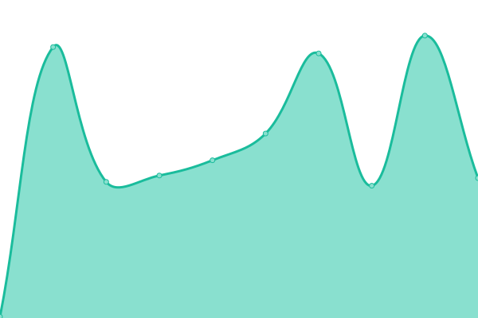
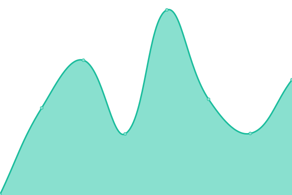
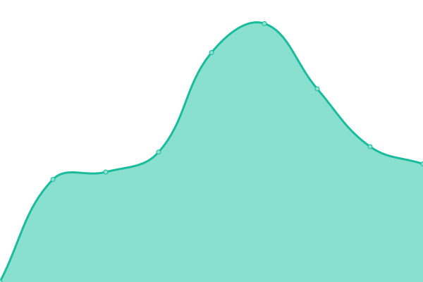
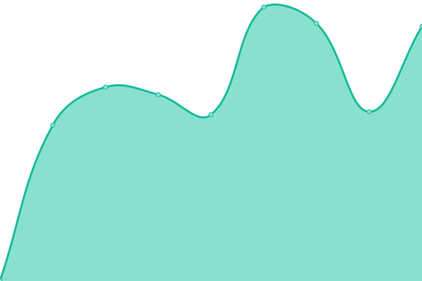

# [📈 Live Status](https://status.indie.work): <!--live status--> **🟩 All systems operational**

This repository contains the open-source uptime monitor and status page for [Upptime](https://upptime.js.org), powered by [Upptime](https://github.com/upptime/upptime).

With [Upptime](https://upptime.js.org), you can get your own unlimited and free uptime monitor and status page, powered entirely by a GitHub repository. We use [Issues](https://github.com/upptime/upptime/issues) as incident reports, [Actions](https://github.com/indietechteam/upptime/actions) as uptime monitors, and [Pages](https://status.indie.work) for the status page.

<!--start: status pages-->
<!-- This summary is generated by Upptime (https://github.com/upptime/upptime) -->
<!-- Do not edit this manually, your changes will be overwritten -->
<!-- prettier-ignore -->
| URL | Status | History | Response Time | Uptime |
| --- | ------ | ------- | ------------- | ------ |
|  [Indie](https://indie.work) | 🟩 Up | [indie.yml](https://github.com/indietechteam/upptime/commits/HEAD/history/indie.yml) | 

 137ms
     
 | 

<a href="https://status.indie.work/history/indie">99.84%</a>
    

|  [Aux](https://aux.app) | 🟩 Up | [aux.yml](https://github.com/indietechteam/upptime/commits/HEAD/history/aux.yml) | 

 139ms
     
 | 

<a href="https://status.indie.work/history/aux">99.84%</a>
    

|  [Direct](https://direct.app) | 🟩 Up | [direct.yml](https://github.com/indietechteam/upptime/commits/HEAD/history/direct.yml) | 

 209ms
     
 | 

<a href="https://status.indie.work/history/direct">100.00%</a>
    

|  [benbowler.com](https://benbowler.com) | 🟩 Up | [benbowler-com.yml](https://github.com/indietechteam/upptime/commits/HEAD/history/benbowler-com.yml) | 

 799ms
     
 | 

<a href="https://status.indie.work/history/benbowler-com">100.00%</a>
    

|  [G0 Labs](https://g0labs.com) | 🟩 Up | [g0-labs.yml](https://github.com/indietechteam/upptime/commits/HEAD/history/g0-labs.yml) | 

 944ms
     
 | 

<a href="https://status.indie.work/history/g0-labs">100.00%</a>
    

|  [RePatched](https://repatched.com) | 🟩 Up | [re-patched.yml](https://github.com/indietechteam/upptime/commits/HEAD/history/re-patched.yml) | 

 2381ms
     
 | 

<a href="https://status.indie.work/history/re-patched">100.00%</a>
    

|  [PrintSignScan](https://printsignscan.app) | 🟩 Up | [print-sign-scan.yml](https://github.com/indietechteam/upptime/commits/HEAD/history/print-sign-scan.yml) | 

 670ms
     
 | 

<a href="https://status.indie.work/history/print-sign-scan">100.00%</a>
    

|  [NHGPC](https://nhgpc.org.uk) | 🟩 Up | [nhgpc.yml](https://github.com/indietechteam/upptime/commits/HEAD/history/nhgpc.yml) | 

 707ms
     
 | 

<a href="https://status.indie.work/history/nhgpc">100.00%</a>
    

<!--end: status pages-->

[**Visit our status website →**](https://status.indie.work)

## 📄 License

- Powered by: [Upptime](https://github.com/upptime/upptime)
- Code: [MIT](./LICENSE) © [Anand Chowdhary](https://anandchowdhary.com), supported by [Pabio](https://pabio.com)
- Data in the `./history` directory: [Open Database License](https://opendatacommons.org/licenses/odbl/1-0/)
